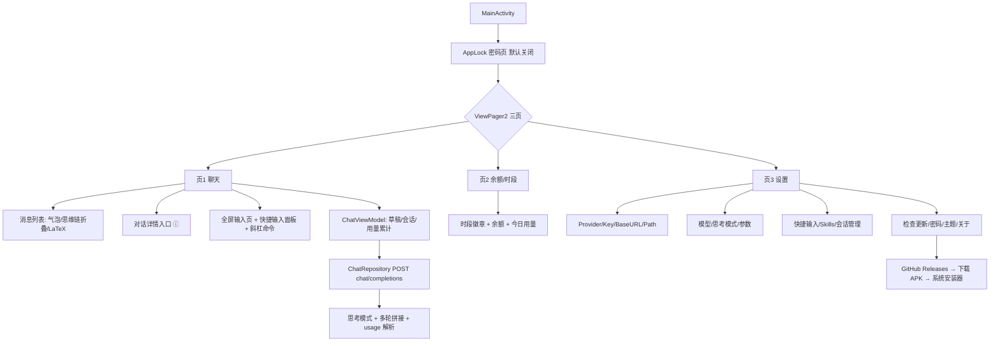

# OPPO Watch X2 AI 助手 **WristChat** — 设计文档 v0.4(待审阅)

> v0.4 新增:GitHub 更新检查、深度思考+思维链折叠、对话详情(消耗/缓存命中/上下文/费用)、多轮对话确认、API Base URL+Path 自定义、设置页顶部会话上限提示。**本轮重点审阅 §11 剩余问题。**
> 状态:**待你审阅**

---

## 0. 项目定位

OPPO Watch X2(圆屏安卓手表)上的轻量 AI 助手:

1. **聊天**:多 Provider(DeepSeek / 通义千问 / 任意 OpenAI 兼容),支持深度思考(思维链可折叠查看)、多轮对话、LaTeX 渲染、快捷输入、Skills
2. **账户**:DeepSeek 余额 / 高峰空闲时段徽章 / 今日用量 / 会话消耗统计
3. **工具**:会话管理、密码锁、主题、**应用内检查更新(从 GitHub 下载并调系统安装器)**

**应用名:WristChat | 包名:`io.github.xhr666.wristchat`**(GitHub 用户名 XHR666,已通过 gh 授权确认)

---

## 1. 目标设备与环境(已确认,同前)

| 项目 | 值 |
|---|---|
| 设备 | OPPO Watch X2 (OWWE251),Android 11 (API 30) |
| 屏幕 | 圆形 466px 直径,320 PPI → density 2.0,最小宽度 233dp,2.06 英寸 |
| 硬件 | 骁龙 W5 Gen 1,2GB RAM,32GB 存储 |
| 表冠 | 标准 `ACTION_SCROLL` 旋转事件(微思商店 APK 反编译证实) |
| 安装 | adb 侧载 / 微思应用商店 / 应用内更新(GitHub Releases) |
| GitHub | 用户名 XHR666(token 来自 gh CLI 授权,仅运行时 API 调用,不入库) |

---

## 2. 技术选型(同前 + 补充)

| 项 | 选择 | 备注 |
|---|---|---|
| 语言/UI | Kotlin + 传统 View(RecyclerView/ViewPager2/自定义圆形遮罩) | 内存优先 |
| 网络 | HttpURLConnection + kotlinx-coroutines | 零第三方网络依赖 |
| 存储 | SharedPreferences + Keystore AES-GCM;会话 JSON 文件 | |
| LaTeX | 懒加载共享 WebView + KaTeX(字体子集 ~500KB) | KaTeX 是 MIT,不污染项目 |
| **深度思考** | `thinking:{type,reasoning_effort}` + `reasoning_content` 折叠展示 | 官方 thinking_mode 文档已核对 |
| **对话详情** | 会话文件累计每次 usage;费用按 峰谷×模型 定价表实时计算 | |
| **更新检查** | GitHub Releases API + 版本比对 + 下载 + 系统安装器 | 见 §7.5 |
| 构建 | compileSdk 34 / targetSdk 34 / minSdk 30 | |

---

## 3. 总体架构



---

## 4. 三个页面

### 4.1 页1 — 聊天

```
┌─────────────────────┐
│ ● 模型名 ⓘ ⟳ ⌨  ⋮  │  ← ⓘ=对话详情,⌨=快捷输入面板
│ ┌───────────────┐  │
│ │ 💭 思考过程 ▸  │  │  ← 思维链折叠(点开看 reasoning_content)
│ │ AI:你好!...   │  │     LaTeX 公式走 KaTeX
│ └───────────────┘  │
│  …(表冠滚动)        │
│ ┌──────────┐  ┌──┐ │
│ │ 输入框…   │  │➤│ │
│ └──────────┘  └──┘ │
└─────────────────────┘
```

**深度思考(要求 2,官方文档已核对):**
- 设置页:思考模式开关(默认开,API 默认)+ effort 选择(低/高/最大;medium/xhigh 官方映射为 high,故 UI 只给 3 档)
- 开启时:响应含 `message.reasoning_content`(思维链)与 `content`(最终回答)
- 展示:AI 气泡上方一条可折叠的「💭 思考过程」,点击展开/收起(展开内容较长时可表冠滚动)
- 多轮回传规则(官方):不带 tools 时 `reasoning_content` **不回传**(传了也被忽略)—— 我们不做 tools,v1 不回传
- 思考模式不支持 temperature/top_p(传了不生效)→ 思考开启时这两个参数控件置灰

**对话详情(要求 3,入口=顶部 ⓘ):**
| 项 | 数据来源 |
|---|---|
| 本次对话消耗 tokens | 每次响应 `usage` 累计(输入+输出,含思考 tokens) |
| 缓存命中率 | `prompt_cache_hit_tokens ÷ prompt_tokens`(每次请求后更新) |
| 占用的上下文 | 最近一次 `prompt_tokens`(当前发出去的上下文大小)+ 消息条数;显示占模型上下文窗口(128K)的百分比 |
| 消耗余额 | 逐条累计:`命中×谷/峰价 + 未命中×谷/峰价 + 输出×谷/峰价`(按该次请求发生时间与模型查定价表,官方 usage 字段已核对) |

**多轮对话(要求 4,官方 multi_round_chat 已核对):**
- API 无状态,客户端自行拼接:系统提示(Skills 注入)→ 历史 user/assistant → 新提问
- 每条消息存会话文件(role/content/时间/该轮 usage/思考链)
- 上限 100 条/会话,超出**不强制清理**,提示建议清理(设置页顶部横幅)

**其他上下文相关功能(要求 5,官方文档筛选后 v1 可实现):**
- ✅ 自动上下文缓存:DeepSeek 自动生效,我们在对话详情展示命中率(零额外成本)
- ✅ 多轮拼接 + 系统提示稳定前缀(提升缓存命中)
- ✅ 思考模式
- 🔸 可选(设置-高级):JSON 输出(response_format)、发送前离线 token 估算(1 中文字≈0.6 token / 1 英文字符≈0.3,官方 token_usage 文档)—— 默认关
- ⏸ v2+:函数调用 tools、FIM 补全、前缀补全、图片理解(图片导入已确认不做)

**输入交互(同 v0.3):** 点输入框 → 全屏输入页(自动唤起输入法,关输入法不发送);快捷输入面板(箭头弹出,点击填入可继续编辑);斜杠命令 `/skills` `/on` `/off`

### 4.2 页2 — 余额/时段(同 v0.3,不变)

时段徽章(北京周一至五 9-12/14-18 为高峰,谷=峰价一半)+ 官方余额(充值/赠送/总余额/可用)+ 今日已用(平台 Token 实时 or 本地记账)+ 本应用累计消费(与会话详情口径一致)

### 4.3 页3 — 设置

| 分组 | 内容 |
|---|---|
| **服务** | Provider:DeepSeek / 通义千问 / 自定义;**API Base URL** 与 **API 路径** 可填写(默认值见下,要求 6);API Key(掩码,加密存储) |
| **模型/思考** | 模型选择(需先填 Key);思考模式开关 + effort(低/高/最大) |
| **快捷输入** | 条目增删改 |
| **Skills** | SAF 导入 / filesDir/skills/ 文件夹 / 刷新扫描 / 斜杠命令启用 |
| **会话** | 会话列表(查看/删除/清空)、总占用空间;**顶部横幅:会话已达上限,建议清理**(要求 A4,不在聊天页弹横幅) |
| **更新** | **检查更新**按钮:调 GitHub Releases,比对版本,发现新 APK 版本→提示→下载→系统安装器(要求 1) |
| **安全/主题** | 密码(默认关,免密默认 5)/ 亮/暗/AMOLED |
| **关于** | 开源仓库、版本、免责声明 |

**API Base URL / 路径默认值(要求 6,已核对官方文档):**

| Provider | Base URL | 路径 | 完整示例 |
|---|---|---|---|
| DeepSeek | `https://api.deepseek.com` | `/chat/completions` | `https://api.deepseek.com/chat/completions` |
| 通义千问 | `https://dashscope.aliyuncs.com/compatible-mode/v1` | `/chat/completions` | `.../v1/chat/completions` |
| 自定义 | 用户填 | 默认 `/chat/completions` | |

> 注:DeepSeek 官方 OpenAI 格式 Base 即 `https://api.deepseek.com`(`/v1` 前缀也可用,但默认不填);Anthropic 格式 `https://api.deepseek.com/anthropic`(本项目走 OpenAI 格式)

---

## 5. 圆屏适配 / 6. 表冠滚动(同 v0.3,不变)

圆形裁剪 + 差异化安全区;方屏退化圆角矩形。表冠 ACTION_SCROLL + 音量键/DPAD 兜底 + 灵敏度可调。

---

## 7. 数据层

### 7.1 接口清单

| 用途 | 方法 | 端点 |
|---|---|---|
| 聊天 | POST | `{BaseURL}{Path}`(OpenAI 兼容) |
| 余额 | GET | `https://api.deepseek.com/user/balance`(仅 DeepSeek) |
| 今日用量(可选) | GET | `https://platform.deepseek.com/api/v0/usage/by_api_key/amount?start=&end=&tz=` |
| **检查更新** | GET | `https://api.github.com/repos/{owner}/{repo}/releases/latest` + 资产下载 |

### 7.2 usage 字段(官方已核对,对话详情用)

`usage`:prompt_tokens(=hit+miss)、prompt_cache_hit_tokens、prompt_cache_miss_tokens、completion_tokens、total_tokens、completion_tokens_details.reasoning_tokens
`message.reasoning_content`:思考模式思维链

### 7.3 定价表(官方,峰谷)

flash/vision:命中 0.05/0.10 · 未命中 1.5/3.0 · 输出 4.5/9.0(元/百万,谷/峰);pro=3 倍。高峰=北京周一至五 9-12/14-18。

### 7.4 会话持久化

每会话一个 JSON(私有目录):消息数组(role/content/reasoning/时间)+ 用量累计字段(总 tokens/缓存命中/费用)。上限 100 条/20 会话,超限提示不清理。设置页显示总占用(文件大小求和)。

### 7.5 检查更新流程(要求 1,防"假更新")

1. 点击「检查更新」→ GET GitHub Releases latest(公开仓库,无需 token)
2. **校验"真更新"**:① 该 release 必须带 APK 资产(无 APK 资产 → 提示"暂无可用更新",**不因 README 提交而提示**)② `tag_name` 语义版本 > 当前 versionName(版本号规则 v主.次.修,比对时忽略预发布)
3. 满足才提示"发现新版本 vX.Y.Z" → 点击下载(进度条,断网重试)
4. 下载完成 → 校验 APK 完整性(PackageManager 可解析 + 与资产 SHA256 匹配,如提供)→ FileProvider 授权 → `ACTION_VIEW`(MIME `application/vnd.android.package-archive`)调**系统安装器**
5. 安装完成回到应用;失败(如"不允许安装未知应用")提示引导去系统设置开启
6. 仓库名/owner 从设置读取默认 `XHR666/wristchat`(可改,见 §11-Q1)

---

## 8. 内存与体积优化(同前 + 更新下载不常驻)

- 更新下载用前台一次性任务,完成后释放;不常驻服务
- 思维链折叠:展开时才 inflate 展开视图;收起仅一行
- 其余同 v0.3 清单(懒加载 WebView / R8 / 无后台服务…)

---

## 9. 安全设计(同前 + 更新通道)

- 仓库零敏感信息;GitHub token 仅存在于本机 gh 配置,App 内更新走**公开 API 无需 token**
- APK 下载全 HTTPS;安装前校验来源(release 资产 URL 固定 GitHub 域名)
- 其余同 v0.3(Keystore 加密 / 最小权限 / 禁明文 / MIT + 只借鉴思路)

---

## 10. 密码锁(同 v0.3:默认关闭;5 错锁 30s;0000×5→解锁后 0000 强制关闭;免密默认 5)

---

## 11. 需要你确认的问题(本轮 frontier)

**Q1 · GitHub 仓库名**:更新检查需要仓库名,默认 `XHR666/wristchat` 对吗?(还是已建好别的仓库名?)
➡️ 推荐:`wristchat`;没建的话我建议现在就建空仓库,后续直接推代码

**Q2 · 思考模式默认值**:默认「开 + effort 高」(API 官方默认)还是「开 + effort 低」?低档在手表上返回更快
➡️ 推荐:开 + effort 低(手表体验优先;设置里可改高档)

**Q3 · 启动时自动检查更新?**:设置里「检查更新」手动按钮之外,是否每次进设置页自动静默检查一次?(有更新才提示,不打扰)
➡️ 推荐:是(进设置页自动查,有新版才弹提示)

**Q4 · 对话详情费用与余额页累计口径**:对话详情累计的消耗金额,同时计入余额页「本应用累计消费」?
➡️ 推荐:计入(两处一致,避免数字对不上)

**Q5 · 上下文窗口提示**:对话详情里显示"已用上下文 X/128K",超 70% 时聊天页顶部一条小字提示"上下文较大,建议开新对话"?(非横幅,不打扰)
➡️ 推荐:是(小字提示,仅一次)

**已定死(本轮):**
- 包名 `io.github.xhr666.wristchat`(GitHub 用户名已从 gh 授权确认)✅
- Skills 双通道(斜杠+设置开关)、中文界面 ✅
- 会话超限 → 设置页顶部提示(非聊天横幅)✅
- API Base URL+Path 可填,DeepSeek/千问默认值已核对 ✅

---

## 12. 里程碑(同前,插入更新功能到 M6)

M0 ✅ 调研+文档 | M1 骨架+遮罩+主题+密码 | M2 设置(Provider/Key/模型/思考/快捷/Skills/会话) | M3 余额+时段 | M4 聊天(全屏输入/多轮/思维链折叠/LaTeX/对话详情/快捷输入) | M5 表冠+方屏 | M6 **更新检查**+内存优化+R8+Qoder 审查+README+开源 | M7 实机反馈

---

## 13. 变更摘要

**v0.3 → v0.4:** GitHub 更新检查(§7.5)、深度思考+思维链折叠(§4.1)、对话详情(§4.1)、多轮对话确认(§4.1)、API Base URL+Path(§4.3/§7.1)、设置页会话上限提示(§4.3)、包名确定 io.github.xhr666.wristchat(§0)、GitHub 用户名经 gh 授权确认

**v0.2 → v0.3:** 应用名 WristChat、会话超限只提醒、密码默认关、Skills 文件夹扫描+斜杠命令、流式 v2
