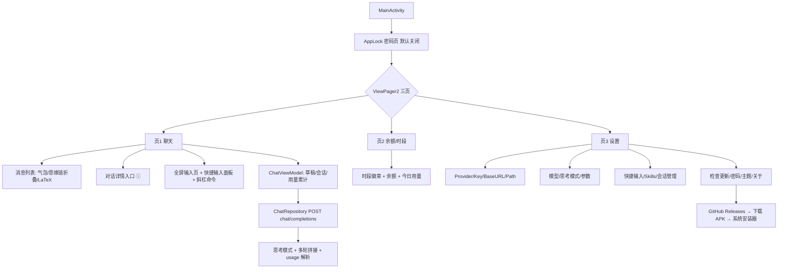

# OPPO Watch X2 AI 助手 **WristChat** — 设计文档 v0.6(待审阅)

> v0.6 新增:手机同步方案(局域网 Web 配置页)、缓存清理、Markdown 渲染、思维链默认折叠、记忆工具(function calling)、手机端改参数(温度/TopP/自定义 Prompt/Skills)、聊天记录导入。**本轮重点审阅 §11 剩余问题。**
> 状态:**待你审阅**

---

## 0. 项目定位

OPPO Watch X2(圆屏安卓手表)上的轻量 AI 助手:

1. **聊天**:多 Provider(DeepSeek / 通义千问 / 任意 OpenAI 兼容),支持深度思考(思维链可折叠查看)、多轮对话、LaTeX 渲染、快捷输入、Skills
2. **账户**:DeepSeek 余额 / 高峰空闲时段徽章 / 今日用量 / 会话消耗统计
3. **工具**:会话管理、密码锁、主题、**应用内检查更新(从 GitHub 下载并调系统安装器)**、**缓存清理**、**记忆工具**、**聊天记录导入**、**手机同步(手机端改 AI 参数)**

**应用名:WristChat | 包名:`io.github.xhr666.wristchat`**(GitHub 用户名 XHR666,已通过 gh 授权确认)

---

## 1. 目标设备与环境(已确认,同前)

| 项目 | 值 |
|---|---|
| 设备 | OPPO Watch X2 (OWWE251),Android 11 (API 30) |
| 屏幕 | 圆形 466px 直径,320 PPI → density 2.0,最小宽度 233dp,2.06 英寸 |
| 硬件 | 骁龙 W5 Gen 1,2GB RAM,32GB 存储 |
| 表冠 | 标准 `ACTION_SCROLL` 旋转事件(微思商店 APK 反编译证实) |
| 安装 | adb 侧载 / 微思应用商店 / 应用内更新(GitHub Releases) |
| GitHub | 用户名 XHR666(token 来自 gh CLI 授权,仅运行时 API 调用,不入库) |

---

## 2. 技术选型(同前 + 补充)

| 项 | 选择 | 备注 |
|---|---|---|
| 语言/UI | Kotlin + 传统 View(RecyclerView/ViewPager2/自定义圆形遮罩) | 内存优先 |
| 网络 | HttpURLConnection + kotlinx-coroutines | 零第三方网络依赖 |
| 存储 | SharedPreferences + Keystore AES-GCM;会话 JSON 文件 | |
| LaTeX | 懒加载共享 WebView + KaTeX(字体子集 ~500KB) | KaTeX 是 MIT,不污染项目 |
| **Markdown** | 无公式消息:**Markwon 原生渲染**(MIT,Span 级,零 WebView);含公式消息:同一懒加载 WebView 里 **marked.js(转 HTML)+ KaTeX**(marked 也是 MIT) | 两种渲染,内存都可控 |
| **记忆工具** | function calling `memory_tool`(create/edit/delete,仿 rikkahub 设计)+ 手动斜杠命令 | 记忆注入 `<memories>` 系统提示;带 tools 时思维链按官方规则回传 |
| **手机同步** | 手表设置页启动**临时局域网 HTTP 服务**(前台时运行)+ 手机浏览器打开 Web 配置页 | 手机零安装;OPPO 杀后台严,服务仅前台存活 |
| **导入** | chatbox backup v2(zip) / OpenAI JSON·JSONL / 纯文本 | 格式探测自动识别 |
| **深度思考** | `thinking:{type,reasoning_effort}` + `reasoning_content` 折叠展示 | 官方 thinking_mode 文档已核对 |
| **对话详情** | 会话文件累计每次 usage;费用按 峰谷×模型 定价表实时计算 | |
| **更新检查** | GitHub Releases API + 版本比对 + 下载 + 系统安装器 | 见 §7.5 |
| 构建 | compileSdk 34 / targetSdk 34 / minSdk 30 | |

---

## 3. 总体架构



---

## 4. 三个页面

### 4.1 页1 — 聊天

```
┌─────────────────────┐
│ ● 模型名 ⓘ ⟳ ⌨  ⋮  │  ← ⓘ=对话详情,⌨=快捷输入面板
│ ┌───────────────┐  │
│ │ 💭 思考过程 ▸  │  │  ← 思维链折叠(点开看 reasoning_content)
│ │ AI:你好!...   │  │     LaTeX 公式走 KaTeX
│ └───────────────┘  │
│  …(表冠滚动)        │
│ ┌──────────┐  ┌──┐ │
│ │ 输入框…   │  │➤│ │
│ └──────────┘  └──┘ │
└─────────────────────┘
```

**深度思考(要求 2,官方文档已核对):**
- 设置页:思考模式开关(默认开)+ effort 选择(低/高/最大;medium/xhigh 官方映射为 high,故 UI 只给 3 档)
- **手表端默认「开 + effort 低」**(返回快,设置里可调;你已确认)
- 开启时:响应含 `message.reasoning_content`(思维链)与 `content`(最终回答)
- 展示:AI 气泡上方一条**默认自动折叠**的「💭 思考过程」(思考完毕后自动收起,你已确认),点击展开/收起(展开内容较长时可表冠滚动)
- 多轮回传规则(官方):不带 tools 时 `reasoning_content` **不回传**(传了也被忽略)—— 我们不做 tools,v1 不回传
- 思考模式不支持 temperature/top_p(传了不生效)→ 思考开启时这两个参数控件置灰

**对话详情(要求 3,入口=顶部 ⓘ):**
| 项 | 数据来源 |
|---|---|
| 本次对话消耗 tokens | 每次响应 `usage` 累计(输入+输出,含思考 tokens) |
| 缓存命中率 | `prompt_cache_hit_tokens ÷ prompt_tokens`(每次请求后更新) |
| 占用的上下文 | 最近一次 `prompt_tokens`(当前发出去的上下文大小)+ 消息条数;显示占模型上下文窗口(128K)的百分比 |
| 消耗余额 | 逐条累计:`命中×谷/峰价 + 未命中×谷/峰价 + 输出×谷/峰价`(按该次请求发生时间与模型查定价表,官方 usage 字段已核对) |

**多轮对话(要求 4,官方 multi_round_chat 已核对):**
- API 无状态,客户端自行拼接:系统提示(Skills 注入)→ 历史 user/assistant → 新提问
- 每条消息存会话文件(role/content/时间/该轮 usage/思考链)
- 上限 100 条/会话,超出**不强制清理**,提示建议清理(设置页顶部横幅)

**上下文自动压缩(你 A5 确认:超出就直接压缩,不弹提示):**
- 上下文窗口:官方 **1M tokens**(三个 v4 模型均 1M;输出最大 384K,已从官方定价页核对)
- 触发:发送前估算(上次 prompt_tokens + 新增消息)超过阈值(默认窗口 **85%**,设置可调)→ **自动压缩**,不询问
- 流程:① 取最旧的 N 条消息(压到剩余+摘要预估远低于阈值,如 50%)② 用**同一个默认模型**(你已确认压缩模型=默认模型)以固定压缩指令生成摘要(压缩请求 thinking=disabled,更快更省)③ 旧消息替换为一条 `system` 摘要消息(「对话摘要:…」)④ 聊天页插入一条分割线「📌 已压缩前 N 条消息」,摘要可展开查看 ⑤ 压缩消耗的 tokens/费用计入对话详情
- 压缩失败(网络/超时)不阻塞:放弃压缩,本次照常发送,下次再试

**其他上下文相关功能(要求 5,官方文档筛选后 v1 可实现):**
- ✅ 自动上下文缓存:DeepSeek 自动生效,我们在对话详情展示命中率(零额外成本)
- ✅ 多轮拼接 + 系统提示稳定前缀(提升缓存命中)
- ✅ 思考模式
- 🔸 可选(设置-高级):JSON 输出(response_format)、发送前离线 token 估算(1 中文字≈0.6 token / 1 英文字符≈0.3,官方 token_usage 文档)—— 默认关
- ⏸ v2+:函数调用 tools、FIM 补全、前缀补全、图片理解(图片导入已确认不做)

**输入交互(同 v0.3):** 点输入框 → 全屏输入页(自动唤起输入法,关输入法不发送);快捷输入面板(箭头弹出,点击填入可继续编辑);斜杠命令 `/skills` `/on` `/off`、`/remember` `/memories` `/forget`(记忆)

**Markdown 渲染(要求 3):**
- 无公式消息:Markwon 原生渲染(标题/加粗/斜体/行内代码/代码块/列表/引用/链接)
- 含公式消息:同一懒加载 WebView(marked.js→HTML + KaTeX 渲染公式)
- 代码块支持复制(长按弹出复制,可分享到手机)

### 4.2 页2 — 余额/时段(同 v0.3,不变)

时段徽章(北京周一至五 9-12/14-18 为高峰,谷=峰价一半)+ 官方余额(充值/赠送/总余额/可用)+ 今日已用(平台 Token 实时 or 本地记账)+ 本应用累计消费(与会话详情口径一致)

### 4.3 页3 — 设置

| 分组 | 内容 |
|---|---|
| **服务** | Provider:DeepSeek / 通义千问 / 自定义;**API Base URL** 与 **API 路径** 可填写(默认值见下,要求 6);API Key(掩码,加密存储) |
| **模型/思考** | 模型选择(需先填 Key);思考模式开关(默认开)+ effort(**默认低**);上下文窗口显示(默认 1M)、压缩阈值(默认 85%)、max_tokens(默认 4096);**温度/TopP**(思考开启时置灰);**自定义系统 Prompt**(默认空,注入所有对话) |
| **快捷输入** | 条目增删改 |
| **Skills** | SAF 导入 / filesDir/skills/ 文件夹 / 刷新扫描 / 斜杠命令启用 |
| **记忆** | 记忆列表(查看/删除/清空,`<memories>` 注入);自动记忆开关(模型 tool call 自动写入) |
| **会话** | 会话列表(查看/删除/清空)、总占用空间;**顶部横幅:会话已达上限,建议清理**(要求 A4,不在聊天页弹横幅);**导入聊天记录**(要求 7) |
| **存储/缓存** | **缓存清理**(要求 2):分项显示大小 + 清理 |
| **同步** | **手机同步**(要求 1/6):启动临时 Web 配置页,手机浏览器改参数 |
| **更新** | **检查更新**(手动按钮)+ **进设置页自动静默检查**(冷却 15 分钟,你 A3 确认):调 GitHub Releases,比对版本,发现新 APK 版本→提示→下载→系统安装器(要求 1) |
| **安全/主题** | 密码(默认关,免密默认 5)/ 亮/暗/AMOLED |
| **关于** | 开源仓库、版本、免责声明 |

**API Base URL / 路径默认值(要求 6,已核对官方文档):**

| Provider | Base URL | 路径 | 完整示例 |
|---|---|---|---|
| DeepSeek | `https://api.deepseek.com` | `/chat/completions` | `https://api.deepseek.com/chat/completions` |
| 通义千问 | `https://dashscope.aliyuncs.com/compatible-mode/v1` | `/chat/completions` | `.../v1/chat/completions` |
| 自定义 | 用户填 | 默认 `/chat/completions` | |

> 注:DeepSeek 官方 OpenAI 格式 Base 即 `https://api.deepseek.com`(`/v1` 前缀也可用,但默认不填);Anthropic 格式 `https://api.deepseek.com/anthropic`(本项目走 OpenAI 格式)

### 4.4 手机同步 — 局域网 Web 配置页(要求 1/6,已调研)

**背景(调研结论):**
- OPPO Watch X2 支持网络(第三方 App 可联网,微思商店即用 OkHttp 下载 APK 证实;Watch X2 有 WiFi)
- OPPO 无面向第三方的手机↔手表开放通信 SDK(HeyTap Health 是封闭的);OPPO 开源生态薄弱
- ColorOS Watch **杀后台严重**(社区普遍反馈)→ 不能依赖常驻后台服务
- 手表无摄像头 → 二维码导入不可行(只能手机扫手表,单向);故采用**局域网 HTTP**

**方案(推荐 v1):**
1. 手表设置页「手机同步」→ 开启后**在该页面前台期间**启动临时 HTTP 服务(仅局域网,随机端口,如 `http://192.168.x.x:48765`)
2. 页面显示地址 + **4 位 PIN**(防同网段他人访问);服务 3 分钟无操作自动关闭
3. 手机浏览器(或任意 HTTP 客户端)打开地址 → 输入 PIN → Web 配置页
4. Web 页可修改:**温度、TopP、max_tokens、思考模式/effort、自定义系统 Prompt、模型、快捷输入、Skills 导入(粘贴文本)、Provider/BaseURL/Path/Key(可选)** → 保存写回手表 SharedPreferences
5. 手表端收到保存成功提示,下次对话即生效
6. 关闭页面/超时 → 服务停止,零残留

**v2(可选,工作量大的正式手机 App):**BLE GATT 或局域网自动发现 + 通知同步;列为后续增强

### 4.5 记忆工具(要求 5,设计参考 rikkahub 的 memory_tool,仅思路)

- **自动记忆(function calling)**:聊天请求携带 `tools=[memory_tool]`;模型判断值得记住时调用 `create/edit/delete`,应用本地执行(存 `memories.json`),再回传 tool 结果完成对话
  - 带 tools 时,历史轮次 `reasoning_content` **按官方规则回传**(思考模式下)
  - 记忆内容下次对话自动注入 `<memories>` 标签到系统提示(仿 rikkahub)
  - 内置指导:不存隐私(宗教/政治/性取向等),相似记忆合并,不主动展示记忆内容
- **手动管理(斜杠命令)**:`/remember 内容`、`/memories`(列出)、`/forget <id>`;设置页「记忆」列表可查看/删除/清空
- 存储:`filesDir/memories.json`(轻量,不进会话文件)
- 供应商不支持 tools → 自动记忆关闭,手动命令仍可用

### 4.6 缓存清理(要求 2)

| 项目 | 内容 | 清理方式 |
|---|---|---|
| WebView 缓存 | KaTeX/marked 页面缓存、Cookie | 「清理缓存」一键清(安全,不影响数据) |
| 临时文件 | 更新下载的 APK 残留、导入临时文件 | 同上 |
| 会话数据 | 会话 JSON + 记忆 + 设置(用户数据) | **单独列出**,清理需二次确认 |

- 设置→存储:分项显示大小(WebView 缓存/临时/会话数据/记忆),「清理缓存」「清理全部」
- 目标:缓存控制在 < 10MB 内(WebView 缓存默认上限 5MB)

### 4.7 聊天记录导入(要求 7)

| 格式 | 说明 | 优先级 |
|---|---|---|
| **OpenAI 格式 JSON/JSONL** | `{"messages":[{"role","content"}]}` 或每行一条 | 最先做(通用) |
| **chatbox backup v2** | zip:manifest.json + sessions/<id>/session.json(与 rikkahub 导入同格式,格式已核实) | 其次 |
| **纯文本** | `user:`/`assistant:` 或 `我:`/`AI:` 前缀逐行解析 | 可选 |

- 入口:设置→会话→导入聊天记录(SAF 文件选择)
- 导入前预览(会话条数/消息数),确认后写入新会话;格式无法识别时明确报错
- 导入消息同样计入会话上限与存储统计

---

## 5. 圆屏适配 / 6. 表冠滚动(同 v0.3,不变)

圆形裁剪 + 差异化安全区;方屏退化圆角矩形。表冠 ACTION_SCROLL + 音量键/DPAD 兜底 + 灵敏度可调。

---

## 7. 数据层

### 7.1 接口清单

| 用途 | 方法 | 端点 |
|---|---|---|
| 聊天 | POST | `{BaseURL}{Path}`(OpenAI 兼容) |
| 余额 | GET | `https://api.deepseek.com/user/balance`(仅 DeepSeek) |
| 今日用量(可选) | GET | `https://platform.deepseek.com/api/v0/usage/by_api_key/amount?start=&end=&tz=` |
| **检查更新** | GET | `https://api.github.com/repos/{owner}/{repo}/releases/latest` + 资产下载 |

### 7.2 usage 字段(官方已核对,对话详情用)

`usage`:prompt_tokens(=hit+miss)、prompt_cache_hit_tokens、prompt_cache_miss_tokens、completion_tokens、total_tokens、completion_tokens_details.reasoning_tokens
`message.reasoning_content`:思考模式思维链

### 7.3 定价表(官方,峰谷)

flash/vision:命中 0.05/0.10 · 未命中 1.5/3.0 · 输出 4.5/9.0(元/百万,谷/峰);pro=3 倍。高峰=北京周一至五 9-12/14-18。

### 7.4 会话持久化

每会话一个 JSON(私有目录):消息数组(role/content/reasoning/时间)+ 用量累计字段(总 tokens/缓存命中/费用)。上限 100 条/20 会话,超限提示不清理。设置页显示总占用(文件大小求和)。

### 7.5 检查更新流程(要求 1,防"假更新")

1. 触发:设置页手动按钮,或进设置页自动静默检查(**15 分钟冷却**,上次检查时间戳记录在本地,冷却内不再查)
2. GET GitHub Releases latest(`XHR666/wristchat`,公开仓库,无需 token)
3. **校验"真更新"**:① 该 release 必须带 APK 资产(无 APK 资产 → 提示"暂无可用更新",**不因 README 提交而提示**)② `tag_name` 语义版本 > 当前 versionName(版本号规则 v主.次.修,比对时忽略预发布)
4. 满足才提示"发现新版本 vX.Y.Z" → 点击下载(进度条,断网重试)
5. 下载完成 → 校验 APK 完整性(PackageManager 可解析 + 与资产 SHA256 匹配,如提供)→ FileProvider 授权 → `ACTION_VIEW`(MIME `application/vnd.android.package-archive`)调**系统安装器**
6. 安装完成回到应用;失败(如"不允许安装未知应用")提示引导去系统设置开启
7. owner/repo 默认 `XHR666/wristchat`(已确认),设置里可改

### 7.6 对话费用计算口径(已确认:计入余额页「本应用累计消费」)

每条消息费用 = `命中tokens×命中价 + 未命中tokens×未命中价 + 输出tokens×输出价`(谷/峰按该请求发生时间,模型按当前),逐条累计存会话文件;余额页「本应用累计消费」= 所有会话费用之和(与会话详情一致)

---

## 8. 内存与体积优化(同前 + 更新下载不常驻)

- 更新下载用前台一次性任务,完成后释放;不常驻服务
- 思维链折叠:展开时才 inflate 展开视图;收起仅一行
- 其余同 v0.3 清单(懒加载 WebView / R8 / 无后台服务…)

---

## 9. 安全设计(同前 + 更新通道)

- 仓库零敏感信息;GitHub token 仅存在于本机 gh 配置,App 内更新走**公开 API 无需 token**
- APK 下载全 HTTPS;安装前校验来源(release 资产 URL 固定 GitHub 域名)
- 其余同 v0.3(Keystore 加密 / 最小权限 / 禁明文 / MIT + 只借鉴思路)

---

## 10. 密码锁(同 v0.3:默认关闭;5 错锁 30s;0000×5→解锁后 0000 强制关闭;免密默认 5)

---

## 11. 需要你确认的问题(本轮 frontier)

**Q1 · 手机同步方案确认**:v1 = 局域网 Web 配置页(手机零安装,浏览器打开即改参数;服务仅手表设置页前台时运行,3 分钟无操作自动关)?正式手机 App(BLE/自动发现)放 v2?
➡️ 推荐:是(v1 Web 页覆盖全部改参需求,工作量小;App 版后续再说)

**Q2 · 记忆工具范围**:自动(模型 tool call 写入)+ 手动(斜杠命令)都做?还是 v1 只做手动?
➡️ 推荐:都做(自动是 rikkahub 的精髓;实现代价可控)

**Q3 · 导入格式范围**:OpenAI JSON/JSONL + chatbox backup v2 + 纯文本,三种都做?
➡️ 推荐:都做(优先级 JSON → chatbox → 纯文本;chatbox zip 解析稍复杂)

**Q4 · 缓存清理边界**:WebView 缓存+临时文件 =「清理缓存」一键清(不动用户数据);会话/记忆/设置 =「清理数据」需二次确认 —— 这样分?
➡️ 推荐:是

**Q5 · 自定义系统 Prompt**:设置页加「自定义 Prompt」(默认空,注入所有对话,与 Skills/记忆并列)?手机上也能改(Web 页)?
➡️ 推荐:是(与 Skills 一起注入,顺序:系统 Prompt → Skills → 记忆)

**已定死(本轮):**
- Markdown 渲染:Markwon(无公式)+ marked+KaTeX(有公式)✅
- 思维链思考完毕**自动折叠** ✅
- 手机端可改:温度/TopP/自定义 Prompt/Skills 导入等(Web 配置页)✅
- 聊天记录导入:chatbox backup v2 格式已核实 ✅
- 缓存清理:分「缓存/数据」两级 ✅

---

## 12. 里程碑(同前,插入更新功能到 M6)

M0 ✅ 调研+文档 | M1 骨架+遮罩+主题+密码 | M2 设置(Provider/Key/模型/思考/快捷/Skills/会话) | M3 余额+时段 | M4 聊天(全屏输入/多轮/思维链折叠/LaTeX/对话详情/快捷输入) | M5 表冠+方屏 | M6 **更新检查**+内存优化+R8+Qoder 审查+README+开源 | M7 实机反馈

---

## 13. 变更摘要

**v0.5 → v0.6:** 手机同步(§4.4 局域网 Web 配置页,调研结论:OPPO 无开放手机通信 SDK、杀后台严、无摄像头故不用二维码)、缓存清理(§4.6)、Markdown 渲染(§4.1)、思维链默认折叠(§4.1)、记忆工具(§4.5 function calling+斜杠命令)、手机端改温度/TopP/Prompt/Skills(§4.4)、聊天记录导入(§4.7 chatbox backup v2 格式已核实)、Markwon(marked+KaTeX 双路渲染)

**v0.4 → v0.5:** 思考默认开+effort 低(手表端);进设置自动检查更新(15 分钟冷却);对话费用计入余额页累计;**上下文自动压缩**(阈值 85%、压缩模型=默认模型、摘要分割线可展开);上下文窗口 1M/输出 384K(官方核对);仓库名 XHR666/wristchat 确认

**v0.3 → v0.4:** GitHub 更新检查(§7.5)、深度思考+思维链折叠(§4.1)、对话详情(§4.1)、多轮对话确认(§4.1)、API Base URL+Path(§4.3/§7.1)、设置页会话上限提示(§4.3)、包名确定 io.github.xhr666.wristchat(§0)、GitHub 用户名经 gh 授权确认

**v0.2 → v0.3:** 应用名 WristChat、会话超限只提醒、密码默认关、Skills 文件夹扫描+斜杠命令、流式 v2
